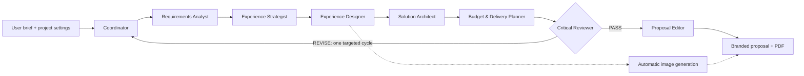
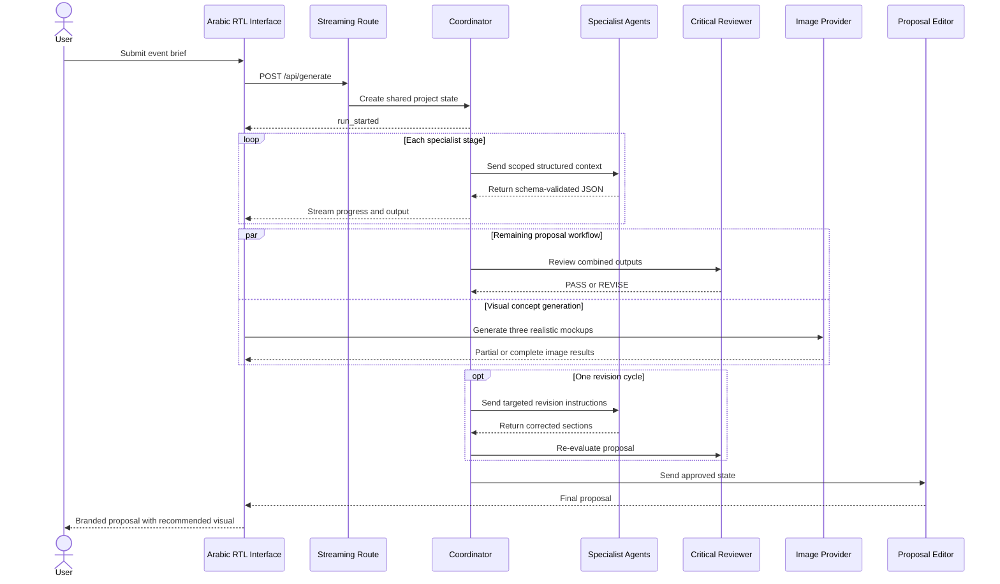
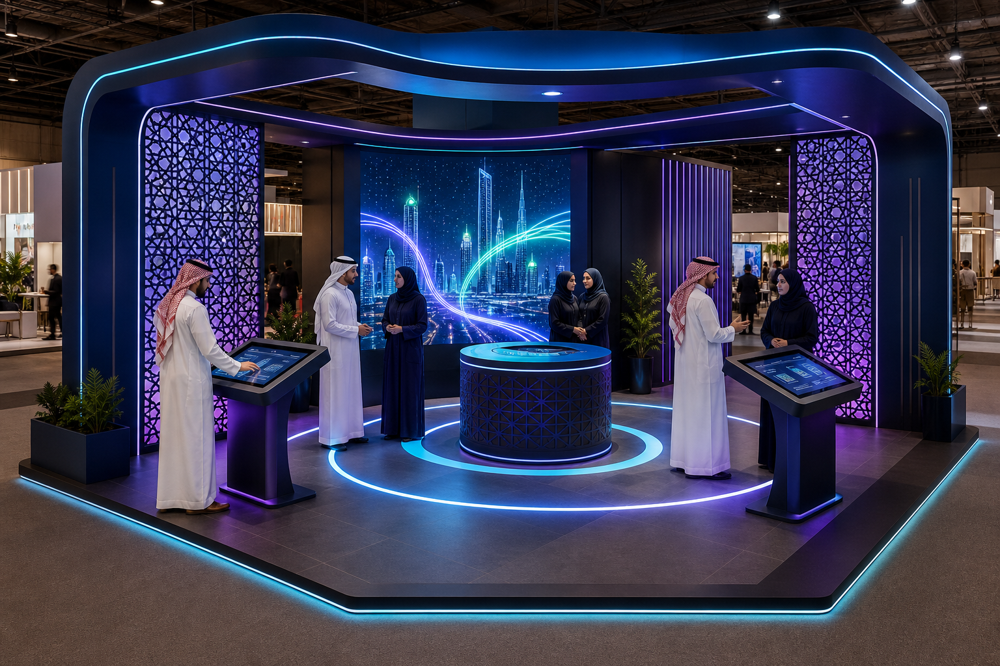
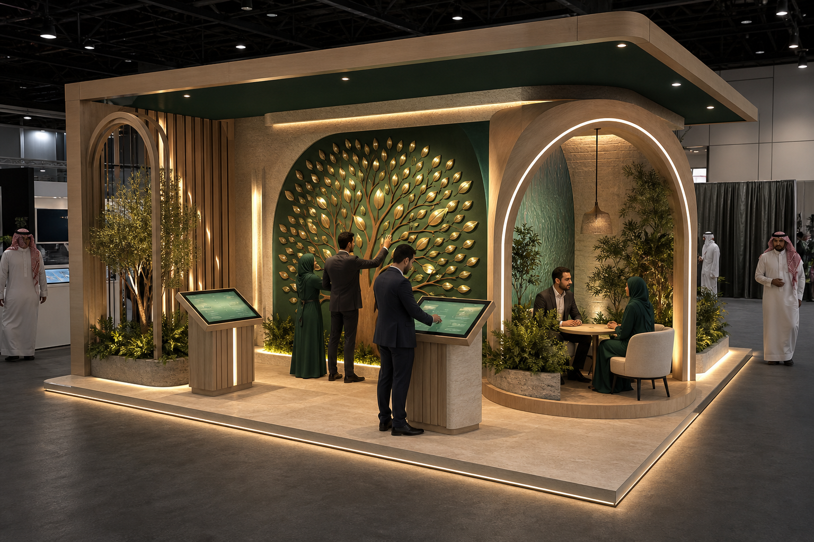
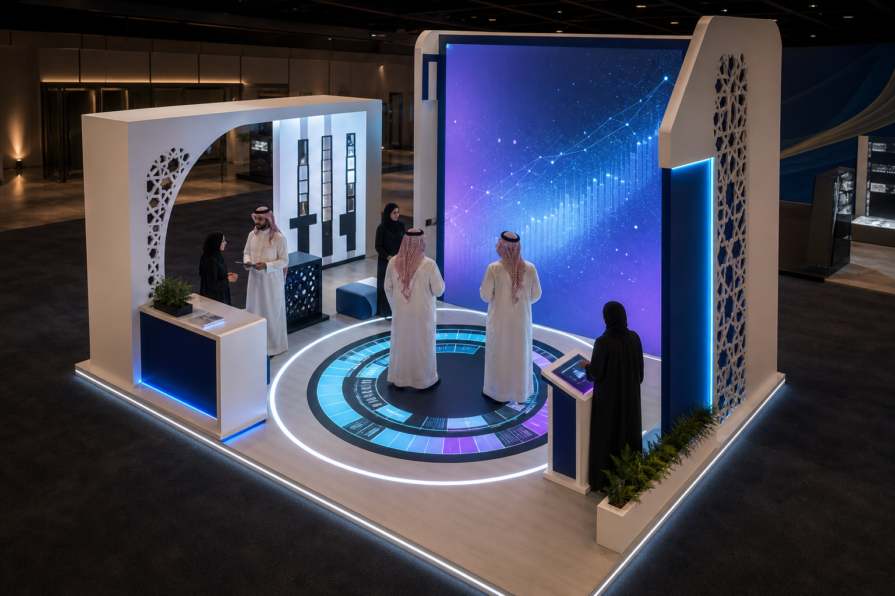

<p align="center">
  
</p>

<h1 align="center">AgentForge</h1>

<h3 align="center">
  A production-minded multi-agent AI workspace for event strategy and execution planning
</h3>

<p align="center">
  <strong>From Brief to Execution</strong>
</p>

<p align="center">
  AgentForge transforms an unstructured event brief into a reviewed, budget-aware,
  technically feasible proposal—with visible agent collaboration, self-correction,
  and automatically generated architectural concepts.
</p>

<p align="center">
  <a href="https://nextjs.org/"></a>
  <a href="https://www.typescriptlang.org/"></a>
  <a href="https://platform.openai.com/"></a>
  <a href="#arabic-first-saudi-ready"></a>
  <a href="https://zod.dev/"></a>
</p>

---

## Why AgentForge exists

Creating a credible event proposal is a multidisciplinary process. A strong result
normally requires a strategist to interpret the brief, a creative team to develop
the concept, a technical architect to validate feasibility, an estimator to control
the budget, a project manager to plan delivery, and a reviewer to find weaknesses
before the proposal reaches a client.

Most AI tools compress all of those responsibilities into one prompt and one long
answer. The result may sound polished, but its reasoning is opaque, its sections can
contradict one another, and its financial calculations are often impossible to trust.

AgentForge treats proposal generation as a coordinated workflow instead of a chat:

- specialist agents own clearly bounded responsibilities;
- every handoff uses schema-validated structured data;
- a shared project state records decisions and dependencies;
- deterministic code verifies financial arithmetic;
- a reviewer can reject weak work and trigger one targeted revision cycle;
- the approved outputs are assembled into a branded, client-ready proposal.

> **Core value proposition:** Event proposals normally require strategists,
> creatives, technical teams, estimators, and project managers. AgentForge
> coordinates those roles as specialized AI agents and converts a brief into a
> reviewed, budget-aware execution plan in minutes.

## Recruiter snapshot

AgentForge demonstrates practical experience across four disciplines:

| Area | What the project demonstrates |
|---|---|
| Full-stack engineering | Next.js App Router, route handlers, streaming responses, cancellation, strict TypeScript, responsive UI, and export workflows |
| AI-agent architecture | Agent boundaries, context routing, shared state, structured outputs, validation, repair, review, and controlled revision |
| Product design | Arabic-first RTL UX, real-time orchestration visualization, progressive disclosure, accessible forms, and branded proposal presentation |
| Reliability engineering | Input validation, graceful provider failures, deterministic budget normalization, API-key isolation, demo fallback, and abort-safe streams |

This is intentionally more than a prompt wrapper. The orchestration, validation,
financial controls, state transitions, provider abstraction, and user experience are
implemented as application logic around the models.

## Product experience

A user can:

1. Enter a free-form event brief in Arabic or English.
2. Add structured details such as client, event, audience, city, space, duration,
   objective, and maximum budget.
3. Watch eight agents work in sequence through live streamed status updates.
4. Inspect each agent's structured output and the shared context passed downstream.
5. Compare three creative directions and their architectural visualization briefs.
6. See the Critical Reviewer score the work and request a targeted revision.
7. Receive a concise, client-ready proposal with concept, journey, experiences,
   technology, budget, timeline, risks, and success metrics.
8. Copy the proposal, download its JSON, or print a branded PDF containing the
   recommended visualization.

## What makes the system agentic?

AgentForge uses language models as reasoning engines, but the application—not the
model—controls the workflow.

Each agent has:

- its own system instructions and professional role;
- an explicit input contract containing only the context it needs;
- a Zod-validated output schema;
- a position in a dependency-aware execution graph;
- lifecycle state such as waiting, thinking, completed, revision, or failed;
- responsibility for updating a shared project state;
- targeted revision behavior controlled by the Coordinator.

The Coordinator does not write the proposal itself. It routes work, manages state,
tracks errors, and decides what must be revised. This separation creates observable
autonomy, collaboration, and self-correction instead of one hidden completion.

## Agent architecture

| Agent | Responsibility | Consumes | Produces |
|---|---|---|---|
| Coordinator | Creates project state, routes tasks, tracks failures, manages revisions | Original brief and form input | Execution decisions and shared state |
| Requirements Analyst | Extracts explicit needs, assumptions, constraints, and missing information | User input | Structured requirements document |
| Experience Strategist | Develops three creative directions and a practical visitor journey | Requirements | Concepts, zones, interactions, and engagement mechanics |
| Experience Designer | Turns the creative directions into buildable visual design briefs | Requirements and strategy | Three design boards and render prompts |
| Solution Architect | Defines software, hardware, integrations, installation, and operations | Approved experience and design | Technical delivery plan |
| Budget & Delivery Planner | Allocates the budget and creates phases, owners, and milestones | Requirements, design, and architecture | Cost plan and implementation timeline |
| Critical Reviewer | Scores quality, detects contradictions, and requests focused changes | All specialist outputs | `PASS` or `REVISE` with instructions |
| Proposal Editor | Converts approved structured outputs into persuasive client-ready content | Reviewed project state | Final branded proposal |



## End-to-end workflow



## Key capabilities

### Transparent orchestration

- Live agent status and activity messages
- Expandable agent outputs
- Visible shared project context
- Reviewer scorecard across eight dimensions
- Clear revision activity instead of hidden retries

### Structured AI outputs

- Separate Zod schema for every specialist
- Structured-output requests where supported
- One automatic repair request after validation failure
- Clear structured error when repair also fails
- No unstructured prose passed between agents

### Financial guardrails

- Programmatic `quantity × unitCost` calculations
- Deterministic subtotal, contingency, tax, total, and remaining-budget values
- Automatic proportional correction if an estimate exceeds the supplied ceiling
- Saudi VAT treatment with an explicit “budget includes VAT” option
- Planning estimates clearly separated from supplier quotations

### Automatic visual concept generation

- Three design directions created by the Experience Designer
- Automatic image generation as soon as the design agent completes
- Generation runs while the remaining proposal workflow continues
- Realistic architectural prompts focused on physical buildability
- AgentForge palette integrated into materials, lighting, and digital accents
- Explicit controls against common synthetic-image artifacts
- Partial-failure handling so one failed image does not discard successful renders
- Recommended visualization embedded in the branded print/PDF layout

### Production-minded interaction design

- Arabic-first interface with complete RTL layout
- Responsive desktop and mobile views
- Framer Motion transitions and agent-state animation
- Loading, empty, success, revision, failure, and cancellation states
- Duplicate-submission protection
- `AbortController` cancellation for generation and image requests
- Copy, JSON download, reset, new-project, and browser PDF actions
- Accessible labels, focus styles, status announcements, and semantic sections

## Arabic-first, Saudi-ready

AgentForge is designed around the context of Saudi event work rather than treating
localization as a final translation layer.

- Native Arabic UI, typography, copy, and RTL composition
- Arabic brief intelligence for budget, duration, location, space, and event type
- SAR as the enforced proposal currency
- VAT-aware budget handling
- PDPL-aware recommendations for visitor data and optional lead capture
- Saudi event-readiness checks covering privacy, licensing, site constraints, and
  operational approvals
- Bilingual experience considerations where appropriate

The application provides planning guidance and verification prompts. It does not
replace legal advice, venue approval, engineering sign-off, or supplier quotations.

## Technology stack

| Layer | Technology |
|---|---|
| Framework | Next.js 14 with App Router |
| Language | TypeScript in strict mode |
| UI | React 18, Tailwind CSS, Framer Motion, Lucide React |
| Validation | Zod |
| Text AI | OpenAI `gpt-5.6-sol` or configurable Gemini model |
| Image AI | OpenAI `gpt-image-2` |
| Streaming | Server-Sent Events over a streamed Next.js route handler |
| Export | Clipboard, JSON download, and browser print/PDF |
| Demo reliability | Deterministic provider with realistic outputs and timing |

## AI provider abstraction

Agent logic does not depend directly on a specific AI vendor. All providers implement
a shared interface:

```ts
interface AIProvider {
  readonly name: "demo" | "openai" | "gemini";
  generate<T>(request: GenerateRequest<T>): Promise<T>;
  generateImage?(prompt: string, signal?: AbortSignal): Promise<string>;
}
```

This keeps agent prompts, schemas, orchestration, and UI behavior stable when the
underlying model changes.

| Provider | Structured text | Image generation | API key required |
|---|---:|---:|---:|
| OpenAI | Yes | Yes | Yes |
| Gemini | Yes | No in the current implementation | Yes |
| Demo | Deterministic validated fixtures | Bundled sample renders | No |

## Reliability and engineering decisions

### The model never owns the budget arithmetic

Language models propose categories and assumptions, but deterministic application
code recalculates every line item and enforces the user's maximum budget. This makes
the financial output explainable and testable.

### Context is deliberately scoped

Agents receive only the upstream information required for their task. This reduces
prompt size, limits accidental coupling, and makes every handoff easier to inspect.

### Revision is bounded

The reviewer can trigger one targeted revision cycle. A hard limit prevents infinite
agent loops while still demonstrating meaningful self-correction.

### Streaming begins before the proposal is complete

The route emits events throughout execution, allowing the UI to update agent status,
messages, outputs, review decisions, and errors in real time. The user never waits at
a blank loading screen for one large response.

### Visual generation is decoupled from proposal success

The application starts image generation automatically after the designer completes.
It runs alongside the remaining workflow, handles each render independently, and
does not erase a valid text proposal if an image provider fails.

### Demo mode is a provider, not a UI shortcut

Demo behavior is implemented behind the same provider contract and passes through
the same schemas and orchestration. This preserves architectural integrity while
ensuring the project can always be judged without external API availability.

## Shared project state

The Coordinator maintains an ephemeral state object containing:

```text
original brief
structured form values
agent lifecycle statuses
validated agent outputs
review decision and score
revision count
final proposal
errors
timestamps
```

The browser exposes a read-only representation of this state so users can verify
that agents are collaborating through shared context.

## Streaming event model

`POST /api/generate` returns `text/event-stream` and emits events such as:

```ts
type AgentEvent =
  | { type: "run_started"; runId: string; timestamp: string }
  | { type: "agent_started"; agentId: string; message: string; timestamp: string }
  | { type: "agent_progress"; agentId: string; message: string; timestamp: string }
  | { type: "agent_completed"; agentId: string; output: unknown; timestamp: string }
  | { type: "review_completed"; decision: "PASS" | "REVISE"; score: number; timestamp: string }
  | { type: "revision_started"; agentIds: string[]; timestamp: string }
  | { type: "run_completed"; finalProposal: unknown; timestamp: string }
  | { type: "run_failed"; error: string; timestamp: string };
```

The frontend consumes the response with `fetch`, incrementally parses SSE messages,
updates the agent pipeline, and cleans up active readers when a run is cancelled or
the page unmounts.

## Project structure

```text
agentforge/
├── app/
│   ├── api/
│   │   ├── generate/route.ts       # Validated streaming generation endpoint
│   │   ├── health/route.ts         # Provider and configuration status
│   │   └── mockups/route.ts        # Automatic architectural render endpoint
│   ├── error.tsx                   # Application error boundary
│   ├── globals.css                 # Theme, RTL details, and print styles
│   ├── layout.tsx                  # Arabic document metadata and fonts
│   └── page.tsx                    # Main client workflow and stream consumer
├── components/
│   ├── agent-card.tsx
│   ├── agent-pipeline.tsx
│   ├── brief-form.tsx
│   ├── design-gallery.tsx
│   ├── final-proposal.tsx
│   ├── review-score.tsx
│   ├── saudi-readiness.tsx
│   ├── shared-context.tsx
│   ├── status-badge.tsx
│   └── trust-center.tsx
├── lib/
│   ├── agents/                     # Eight agent implementations and prompts
│   ├── ai/                         # OpenAI, Gemini, and demo providers
│   ├── orchestration/              # Shared state and event stream helpers
│   ├── schemas/                    # Input and output contracts
│   ├── brief-intelligence.ts       # Deterministic Arabic brief parsing
│   ├── mockups.ts                  # Visualization result contracts
│   └── saudi-event-context.ts      # Saudi planning guidance
├── public/
│   ├── agentforge-mark.svg
│   └── mockups/                    # Bundled demo visualizations
├── .env.example
├── package.json
└── tsconfig.json
```

## Getting started

### Prerequisites

- Node.js 18.17 or newer
- npm
- An OpenAI API key for live text and image generation, or a Gemini API key for
  text generation

### Install

```bash
git clone <your-repository-url>
cd agentforge
npm install
```

Create a local environment file:

**Windows PowerShell**

```powershell
Copy-Item .env.example .env.local
```

**macOS or Linux**

```bash
cp .env.example .env.local
```

Start the development server:

```bash
npm run dev
```

Open [http://localhost:3000](http://localhost:3000).

## Environment configuration

```env
AI_PROVIDER=openai
DEMO_MODE=false

OPENAI_API_KEY=
OPENAI_MODEL=gpt-5.6-sol
OPENAI_IMAGE_MODEL=gpt-image-2

GEMINI_API_KEY=
GEMINI_MODEL=gemini-1.5-flash

DEMO_DELAY_SCALE=1
```

Environment variables without a `NEXT_PUBLIC_` prefix remain server-side and are not
included in the browser bundle.

### OpenAI mode

```env
AI_PROVIDER=openai
DEMO_MODE=false
OPENAI_API_KEY=your_api_key
OPENAI_MODEL=gpt-5.6-sol
OPENAI_IMAGE_MODEL=gpt-image-2
```

OpenAI text and image API access is billed separately from a ChatGPT subscription.
Confirm that the API project has access and billing configured for both models.

### Gemini text mode

```env
AI_PROVIDER=gemini
DEMO_MODE=false
GEMINI_API_KEY=your_api_key
GEMINI_MODEL=gemini-1.5-flash
```

The current Gemini provider supports structured proposal text. Automatic image
generation is currently implemented through OpenAI.

### No-key demo mode

```env
AI_PROVIDER=demo
DEMO_MODE=true
DEMO_DELAY_SCALE=1
```

Demo mode:

- requires no external API key;
- simulates realistic agent timing;
- streams the complete workflow;
- returns high-quality Arabic structured outputs;
- demonstrates a visible revision cycle;
- loads three bundled architectural visualizations;
- uses the same schemas and UI as live providers.

Set `DEMO_DELAY_SCALE=0.3` for a faster recorded demonstration.

## API routes

| Method | Route | Purpose |
|---|---|---|
| `GET` | `/api/health` | Reports active provider, demo mode, and configuration state |
| `POST` | `/api/generate` | Validates the brief and streams the multi-agent workflow |
| `POST` | `/api/mockups` | Generates three architectural visualizations from design boards |

API keys are read only inside server-side provider modules. They are never returned
by the health route or included in streamed events.

## Quality checks

Run all project checks before creating a production build:

```bash
npm run typecheck
npm run lint
npm run build
```

Start the optimized build:

```bash
npm start
```

The project uses strict TypeScript and currently passes type checking, linting, and
the Next.js production build.

## Example brief

> Create an interactive booth for a Saudi bank participating in Cityscape Riyadh.
> The booth should target young professionals, promote financial literacy and
> saving habits, and include a memorable digital experience. The available budget
> is 120,000 SAR, the booth space is 6 × 6 meters, and the activation will run for
> four days.

AgentForge interprets the request, states assumptions, proposes three creative
directions, selects a recommended concept, creates a visitor journey, defines the
technical solution, builds a budget under the supplied ceiling, performs a critical
review, revises weak sections, and produces a branded proposal.

## Sample visual directions

The bundled renders below are used by the deterministic demo provider. Live OpenAI
mode generates new visualizations automatically from the current brief.

<table>
  <tr>
    <td align="center">
      
      <br /><strong>Future in Focus</strong>
    </td>
    <td align="center">
      
      <br /><strong>Financial Garden</strong>
    </td>
    <td align="center">
      
      <br /><strong>Challenge Studio</strong>
    </td>
  </tr>
</table>

## Security and privacy considerations

- API keys remain on the server.
- Incoming request bodies are validated before orchestration starts.
- Agent outputs are validated before entering shared state.
- Provider errors are converted into user-readable failures.
- Visitor experiences are instructed to avoid unnecessary sensitive data.
- Lead capture is treated as optional and consent-based.
- Runs are ephemeral and are not persisted to a database.
- The application does not claim that generated estimates or compliance guidance
  replace professional review.

For a production deployment, authentication, authorization, encrypted persistence,
rate limiting, audit logs, secret rotation, and formal privacy review should be added.

## Known limitations

- Cost estimates are planning figures rather than binding supplier quotations.
- Architectural images communicate a design direction, not construction drawings.
- Final dimensions and materials require a site survey and technical approval.
- Runs are currently ephemeral and disappear after refresh.
- The PDF workflow uses the browser's print engine rather than a server-side renderer.
- Live quality, latency, and cost depend on the selected provider and model.
- Generating three high-quality images can take longer than the text workflow.
- The system contains Saudi-readiness guidance but does not automate permit submission.

## Roadmap

### Near term

- Authenticated workspaces and persistent project history
- Editable proposal sections with human approval gates
- Server-rendered PDF documents and saved brand templates
- Image regeneration at zone level with art-direction controls
- Run comparison, version history, and reviewer diff views

### Product expansion

- Supplier quote ingestion and price benchmarking
- Venue constraint and regulation knowledge bases
- CRM and project-management integrations
- Collaborative commenting and client approval links
- Multilingual proposal editing beyond Arabic and English
- Analytics for visitor engagement and post-event reporting

### Agent-platform improvements

- Durable queues for long-running generations
- Agent tracing, cost telemetry, and latency observability
- Evaluation datasets for requirement coverage and budget accuracy
- Retrieval-augmented Saudi venue and regulatory knowledge
- Human-in-the-loop checkpoints for high-risk decisions
- Parallel execution where agent dependencies allow it

## Thirty-second demo script

1. **0–4 seconds:** Show the preloaded Cityscape Riyadh brief and its automatically
   parsed budget, location, duration, and space.
2. **4–8 seconds:** Click **ابدأ إعداد المقترح** and show the Coordinator activating
   the specialist pipeline.
3. **8–18 seconds:** Expand an agent card and the shared context panel to reveal
   structured handoffs rather than one chatbot answer.
4. **18–23 seconds:** Show the Critical Reviewer returning a score and triggering a
   targeted revision cycle.
5. **23–30 seconds:** Reveal the final proposal, recommended architectural visual,
   budget, timeline, and branded PDF action.

## Suggested interview explanation

> I built AgentForge to explore how generative AI can be made observable and
> dependable in a real product workflow. Instead of asking one model for a complete
> proposal, I separated the work into specialist agents with typed contracts,
> scoped context, shared state, deterministic financial controls, and a reviewer
> that can trigger one bounded correction cycle. The application streams every
> stage to an Arabic RTL interface and automatically incorporates the recommended
> design visualization into a client-ready proposal. The interesting engineering
> work is not only the model call—it is orchestration, validation, failure handling,
> UX, and controlling which decisions belong to code versus AI.

## Hackathon pitch

> Event proposals usually require multiple disciplines and days of coordination.
> AgentForge makes that team visible. Specialized agents interpret, create,
> engineer, estimate, critique, and self-correct through validated shared context.
> The result is not simply an idea: it is a reviewed, visual, budget-aware execution
> plan that a team can inspect, refine, and present.

---

<div align="center">
  <strong>AgentForge</strong><br />
  Built to demonstrate autonomous coordination, structured collaboration, and
  responsible self-correction in applied AI products.
</div>
